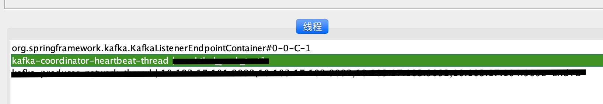

# 背景
公司最近新上一个项目，我负责获取上游数据，经过过滤、处理后，分发给下游各个场景。我司大多数部门重度依赖kafka，此项目中与kafka打交道的地方也甚多。

为了代码质量，也为了之后能快速定位与kafka相关的问题，所以略微研究了kafka相关知识，写作此文，以备后记。

相关技术栈: Java Kafka springBoot

## topic与partition
kafka集群有多台broker组成，集群中每台broker没有主从之分。kafka集群属于对称架构，集群启动时会进行选举,选举一个controller出来，其选举过程依赖zk集群。这个controller负责管理整个集群的partition和partition副本状态、保证集群meta信息的一致性等工作。

例如某topic某partition leader挂了，该controller负责选出新的partition leader；

例如集群新增broker、新创建topic，或者为某topic扩缩容，都需要controller作相关处理。

一个topic可以有多个partition，每个partition可以设置自己的复制因子，这样设计的目的一来可以提高消费者消费的吞吐量，二来冗余数据防止不会因为某台broker的挂掉导致数据的丢失。

假设broker集群有5台机器，某topic设置3个partition，复制因子设为2，则broker集群中有3台机器作为该topic的partition机器，每台partition机器再次选其余4台机器的随机一台机器作为partition副本。
假设某台机器挂掉，controller找到丢失心跳的机器，然后将其副本升为partition leader，然后随机选另外一台机器作为partition副本，保证服务可用性和数据一致性。

如何保证同一条数据先后到达时，保证被consumer顺序消费？

我们知道，每一个consumer消费的是topic中partition中的数据，每个consumer消费的partition不同，消费能力自然也不同，所以要保证同一条数据的顺序消费，须要保证同一条数据入同一个partition，这样就可以保证数据的顺序消费。

我司场景中，每一条数据都有自己的唯一标识，所以在构建ProducerRecord时，以此唯一标识作为key，用来保证同一条数据的顺序消费。

## offset记录与提交
offset分为两种，一种保存在服务器端，一种保存在消费者客户端，保存在服务器端的offset称为committed offset，保存在消费者客户端的offset称为current offset。

current offset保留在消费者客户端，含义是下一次poll时要去拉取的offset；committed offset保留在服务端，含义是当发生rebalance时，服务器给消费者端推message的起始位置。

怎么根据offset确定message的所在位置？

offset的保存是按照groupid-topic-partition存放的，当consumer去poll时，自身已知groupid、topic、partition和要拉取的offset，根据这4个参数可以知道message所在的位置，然后去拉取数据即可。

## kafka broker rebalance
什么是rebalance? 从表现上来看，kafka根据保留在服务端的offset，重新分配给订阅该topic的group中的consumer。

kafka broker rebalance的动作发在kafka服务端，导致rebalance的原因有很多，常见的有以下几种：

1，consumer group中consumer数量或状态发生变化

2，consumer消费太慢提交offset太晚，导致出现rebalance

`Error while processing: org.apache.kafka.clients.consumer.CommitFailedException: Commit cannot be completed since the group has already rebalanced and assigned the partitions to another member. This means that the time between subsequent calls to poll() was longer than the configured max.poll.interval.ms, which typically implies that the poll loop is spending too much time message processing. You can address this either by increasing the session timeout or by reducing the maximum size of batches returned in poll() with max.poll.records.`

之前有同事碰到过相似的问题，看监控显示kafka消费能力明显下降，每分钟只能消费几十条，导致lag不断增加。后来查找原因是业务逻辑中调用的某个http接口超时重试时间太长，导致提交offset超时，一直处于rebalance状态，consumer其实一直在重复着消费最新的消息，导致消费能力明显下降。

在项目中，跟rebalance相关的配置有以下几个：

heartbeat.interval.ms：consumer向group coordinator发送heartbeat的间隔时间

session.timeout.ms：coordinator认为consumer挂掉的时间 

max.poll.interval.ms：两次poll之间的最大间隔时长

max.poll.records：每次poll的最大数量

新版本的kafka中，分离出heartbeat线程和消费线程，如上图，heartbeat线程每隔heartbeat.interval.ms时间发送一个heartbeat给group coordinator，如果在session.timeout.ms时间内仍然没有
收到heartbeat，则group coordinator认为group中某consumer挂掉，则集群会发生rebalance；消费线程受max.poll.interval.ms和max.poll.records控制，假设一次poll了max.poll.records条
record，但却在max.poll.interval.ms内受其它因素影响没有提交offset，group coordinator会认为消费线程没有正确处理处理，集群会发生rebalance，根据服务端的offset记录重新分配给consumer group中
的consumer进行消费。

## 多线程消费与异常处理

topic可以有多个partition，上面提到多分区可以提高消费者的吞吐量是什么意思呢？

一个consumer group中可以有多个consumer，这些consumer有共同的group-id，当一个consumer group订阅某个topic消费的时候，其实是该group下的consumer与topic下的partition的对应关系。
假设topic有12个分区，一个consumer group中有12个consumer，则将是一个consumer和一个partition的一一对应关系；

若consumer group中有10个consumer，则将有8个consumer各单独消费一个partition，2个consumer消费2个partition;

若consumergroup中有15个consumer，则将有3个consumer空闲，不会分配partition使其消费。

当一个consumer group中有多个consumer消费同一个topic时，也就提高了吞吐量。springboot中有专门的配置这一属性：

当我们消费topic时，取出的数据是二进制流，需要反序列化成对象才能处理。由于kafka本身没有类似schema校验的东西，所以需要在producer和consumer
在生产和消费额时候保持约定，但难免会有一些不规范的数据格式；另外，在消费过程中，可能会抛出一些没有捕获的异常，所以为了程序的健壮性，异常处理是十分必要的。

异常处理有两种方式：

一是在代码内try...catch...进行处理，这种实现方式简单粗暴，但将异常处理逻辑与业务逻辑混在一起，不太直观优雅

二是在进行kafkaListenerContainerFactory构建过程中，实现ConsumerAwareListenerErrorHandler类中handleError方法，将异常处理逻辑放在此处，解耦了业务逻辑与异常逻辑。

同时测试发现，在kafkaListener中抛出异常时，此异常会被这个方法捕获，不会再向上抛出，所以不会导致线程销毁再创建，适合我们的业务场景。

## 参考

https://www.cnblogs.com/hapjin/p/10926882.html

https://zhuanlan.zhihu.com/p/108564156

https://cloud.tencent.com/developer/article/1530498

https://www.jianshu.com/p/449074d97daf