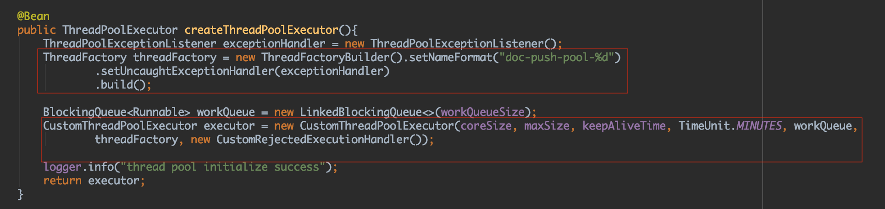
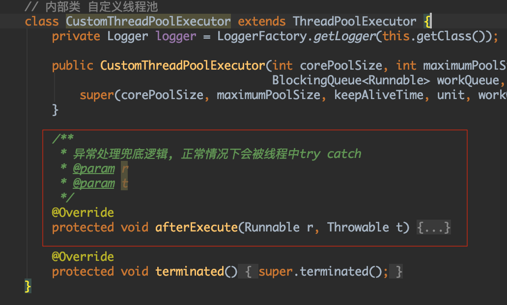
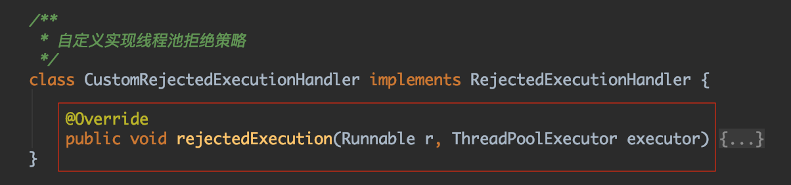

# 背景
目前服务器的cpu核数大多数为32核甚至更高，单进程单线程的程序无法利用多核cpu的能力，这也是一种资源浪费。为了充分利用cpu的处理能力，对于cpu密集型的任务，多线程的运行方式能提高吞吐量。

公司最近的新项目也用到了线程池处理任务的方式，目前开发基本完成，实际效果留待之后观察。

我认为采用多线程接受任务任务的方式是之后主流，所以结合实际项目，略微研究了一下线程池相关知识，以备后记。

相关技术栈: Java thread pool springBoot

## 线程池配置

coreSize: 核心线程数，当有任务来时，创建线程执行任务

maxSize: 最大线程数

keepAliveTime: 超过coreSize的线程空闲的最大时间

unit: 时间单位

workQueue: 阻塞队列，线程数超过coreSize时，新提交任务进入阻塞队列

threadFactory: 线程工厂，用来创建线程，可以指定创建线程的名字、指定新创建的线程是否为守护线程、指定线程的未捕获异常处理器

rejectHandler: 任务拒绝的处理器，如果线程数量超过最大线程数，新提交任务执行拒绝策略

## 异常处理和拒绝逻辑

实际项目中，我们会封装一个类，这个类继承Thread或实现runnable接口，业务逻辑会实现在run方法中。业务逻辑常常会设计调用第三方接口、查询数据库等，难免会抛出一些未
捕获的异常，对这些异常的处理就尤为重要，否则大量线程出现异常会导致线程池的不可用和业务的影响。

afterExecute方法是ThreadPoolExecutor的一个方法，这个方法默认实现是空的。当线程有未经捕获的异常抛出时，会调用afterExecute方法，第二个参数Throwable不为null，则代表异常的
具体类型，我们可以判断Throwable是否为null来检测线程是否正常，当不为null时，来执行发生异常时的业务处理逻辑。当然，在我们的业务线程类中，会try...catch..到抛出的异常，此处的异常处理
是我们的异常兜底逻辑。

PS：经过测试，项目中用execute提交异常任务时，有以下发现：

1、重写afterExecute方法依然不能捕获异常，还会继续向上抛出；

2、而重写Thread.UncaughtExceptionHandler接口能捕获异常，不再向上抛出；

目前不清楚具体原因，不过经过自己反复对比发现，这两种处理异常的方式，原来线程都会销毁再重新创建，这销毁再创建线程的开销应该是有的。

所以采用直接在业务线程类中try..catch...，这种方式异常会被捕获，不会向上抛出，而线程也不需要销毁再创建，虽然不太优雅，但却是权衡之后目前最好的实现方式。

重写RejectedExecutionHandler接口中的rejectedExecution方法，可以实现线程池不能提交任务时的业务拒绝逻辑，保证业务处理的完整性。

## 参考

https://blog.csdn.net/Jack_SivenChen/article/details/53394058

https://www.jianshu.com/p/30e488f4e021