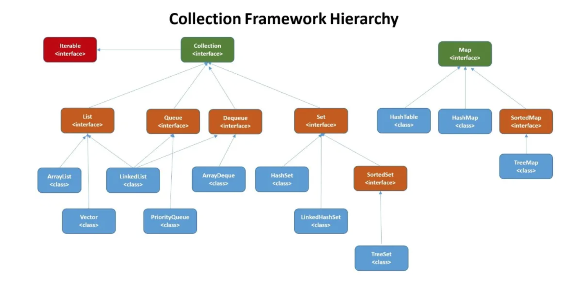

# 背景

相关技术栈: Java 

##集合

Collection
* List
  - ArrayList 
  - Vector 线程安全
  - LinkedList 底层双向链表

* Set 
  - HashSet 
  - LinkedHashSet 能够按照添加的顺序遍历
  - TreeSet 底层红黑树
  
* Queue
  - LinkedList
  - PriorityQueue 非并发
  - ConcurrentLinkedQueue
  
* Deque
  - ArrayDeque
  
* Iterable

Map
* HashMap hash冲突时，使用数组+红黑树解决
* HashTable 线程安全，不推荐使用
* SortedMap
* ConcurrentHashMap 线程安全，JDK1.7使用分段锁对整个桶数组分割分段，每一把锁只锁容器的一部分数据，多线程访问容器里不同数据段的数据，不会存在锁竞争，提高并发访问率。JDK1.8时摒弃分段概念，直接使用Node数组+链表+红黑树实现，并发控制使用Synchronized和CAS来操作。synchronized只锁定当前链表或红黑二叉树的首节点，这样只要hash不冲突，就不会产生并发。

同步容器和并发容器

同步容器将所有对容器状态的访问都串行化，代价是严重降低并发性，当多个线程竞争容器的锁时，吞吐量将严重降低。

并发容器允许多线程同时使用容器，并保证线程安全。Java工具包采用多种优化方式提高并发容器的执行效率。核心是锁、CAS、读写分离、分段锁。

同步容器：Vector、Stack、HashTable、Collections提供的同步集合类
* List list = Collections.synchronizedList(new ArrayList());
* Set set = Collections.synchronizedSet(new HashSet());
* Map map = Collections.synchronizedMap(new HashMap());

JDK1.5推出并发容器包

1、CopyOnWriteArrayList，线程安全的ArrayList，实现机制是在对容器有写入操作时，copy出一份副本数组，完成操作后将数组副本赋值给容器。底层是通过ReentrantLock实现保证同步，牺牲容器的一致性来换取容器的高并发效率（copy时期读取到的是旧数据），适合读多写少、不需要强一致性的场景使用。
2、CopyOnWriteArraySet
3、ConcurrentHashMap，线程安全的HashMap，key和value都不能为null，jdk8之前采用分段锁机制提高并发效率，操作同一段时才需要加锁；jdk8之后，废弃分段锁，采用CAS算法。
4、ConcurrentSkipListMap，线程安全的TreeMap，拿空间换时间，通过建立多级索引实现二分查找遍历有序链表，时间复杂度O(log n)，实现远比红黑树简单。
5、ConcurrentSkipListSet，线程安全的TreeSet

Queue类型
1、ArrayBlockingQueue，数组实现的有界阻塞线程安全队列，底层采用ReentrantLock保证并发情况下的线程安全
2、LinkedBlockingQueue，单向链表线程安全阻塞队列
3、PriorityBlockingQueue，支持优先级的阻塞队列，默认情况下自然序，可以自定义类实现compareTo方法指定元素排列规则
4、SynchronousQueue，不存储元素的阻塞队列，会直接将元素交给消费者，必须等队列中的元素被消费后才能往里添加
5、ConcurrentLinkedQueue，高效的并发队列，线程安全的LinkedList

Comparable和Comparator的区别
1、comparable接口实际上是出自java.lang包，它有一个compareTo(Object obj)方法用来排序
2、comparator接口实际上是出自java.util包它有一个compare(Object obj1, Object obj2)方法用来排序

一个对象如果需要排序，一般实现comparable接口中compareTo方法；comparator接口一般用于如下场景

`Collections.sort(arrayList, new Comparator<Integer>() {
             @Override
             public int compare(Integer o1, Integer o2) {
                 return o2.compareTo(o1);
             }
         });`

HashMap底层key插入：首先计算key的hashcode值判断对象插入数组的位置，如果此位置没有，直接插入；如果有数据，遍历链表，调用equals方法查找是否有值相同的对象，有则覆盖，没有则追加到链表后面

## 博客总结
如果一个线程调用了一个对象的同步方法，例如synchronized xxx()这种形式，那么这个线程不仅持有该类对象的锁，同时持有该父类对象的锁，因此其它线程不能访问父类中的其它同步方法，调用线程会进入阻塞状态。
<https://blog.csdn.net/u014745069/article/details/80753363>

## 参考
《深入理解Java虚拟机：JVM高级特性与最佳实践（第二版)》
