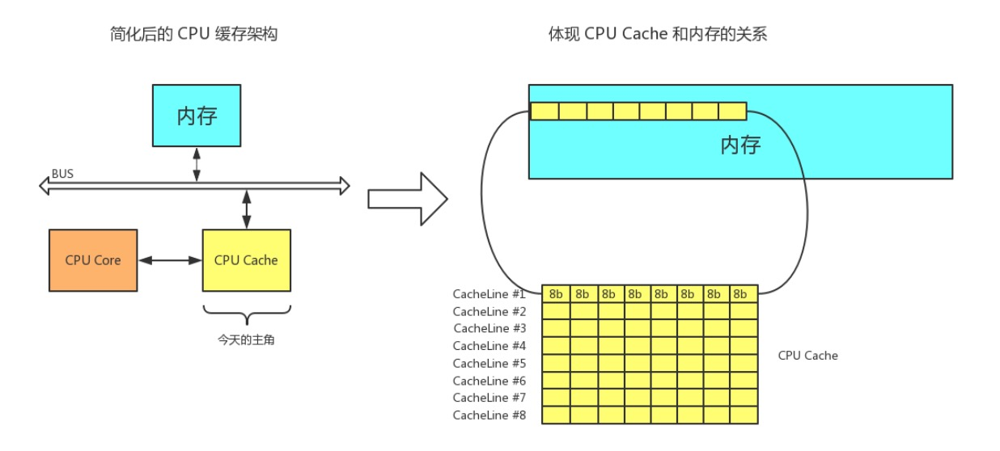

&emsp;&emsp;很多开发同学可能只是大概了解这些用法，但如果深入研究下，会有很大的收获，也能更好地使用他们。 

##### 并发编程带来的问题

&emsp;&emsp;Java内存模型规定，所有的变量都放在主内存，当需要使用时，会把主内存里面的变量复制到自己的工作内存，线程读写变量操作的都是自己工作内存的变量。
Java内存模型是一个抽象的概念，在实际实现中，每个CPU核都有自己的一级缓存，被集成到CPU内部，在某些架构中还有一个所有CPU都共享的二级缓存。Java内存模型里的工作内存对应着这里的L1或L2缓存或CPU的寄存器。 

##### synchronized

&emsp;&emsp;synchronized块是Java提供的一种原子性内置锁，Java中的每个对象都可以当做一个同步锁来使用。线程的执行代码进入synchronized代码块前会自动获取内部锁，这时候其它线程访问该同步代码块会被阻塞挂起。
拿到内部锁的线程在正常退出代码块或者抛出异常后或者在同步块内调用了该内置锁资源的wait系列方法时释放该内置锁。内置锁是排它锁，也就是当一个线程获取锁后，其它线程必须等待该线程释放锁后才能获取该锁。 

&emsp;&emsp;由于Java中的线程是与操作系统的原生线程一一对应的，当阻塞一个线程时，需要从用户态切换到内核态执行阻塞操作，会导致上下文切换，这是一个很耗时的操作。 

##### volatile

&emsp;&emsp;当一个变量被声明为volatile时，线程在写入变量时不会把值缓存在寄存器或缓存中，而是会把值刷新回主内存。当其它线程读取该共享变量时，会从主内存重新获取最新值，而不是使用当前线程工作内存的值。
可以这样理解，线程写入volatile变量值时等价于线程退出synchronized同步块，此时会把写入工作内存的变量值同步到主内存，读取volatile变量时相当于进入同步块，此时会清空本地内存变量值，再从主内存获取最新值。 

&emsp;&emsp;volatile还有防止指令重排序的功能。 
&emsp;&emsp;写volatile变量时，可以确保volatile写之前的操作不会被编译器重排序到volatile写之后。 
&emsp;&emsp;读volatile变量时，可以确保volatile读之后的操作不会被编译器重排序到volatile读之前。 

&emsp;&emsp;volatile关键字能保持共享变量的可见性，但不能保证复合操作的原子性。一般什么时候适合使用volatile变量？ 

1. 写入变量值不依赖变量的当前值 

##### CAS

&emsp;&emsp;CAS，即Compare and Swap，jdk提供的非阻塞原子操作，通过硬件保证了比较-更新操作的原子性。 

&emsp;&emsp;boolean compare(Object obj, long valueOffset, long expect, long update) 
&emsp;&emsp;参数分别为对象内存位置、对象中变量的偏移量、变量预期值、新值，含义为如果对象obj中内存偏移量为valueOffset的变量值为expect，则使用新的值update替换旧的值expect。这个方法是处理器提供的原子性指令。 

&emsp;&emsp;CAS可能会带来的ABA问题，JDK中AtomicStampedReference类给每个变量的状态值都配备了一个时间戳，避免了ABA问题的产生。 

##### CPU Cache

Cache一般是集成到CPU内部，Cache内部按行存储，其中每一行称为一个Cache行。Cache行是Cache与主内存进行数据交互的单位，Cache行的大小一般为2的幂次数字节。

##### 参考

《并发编程之美》
